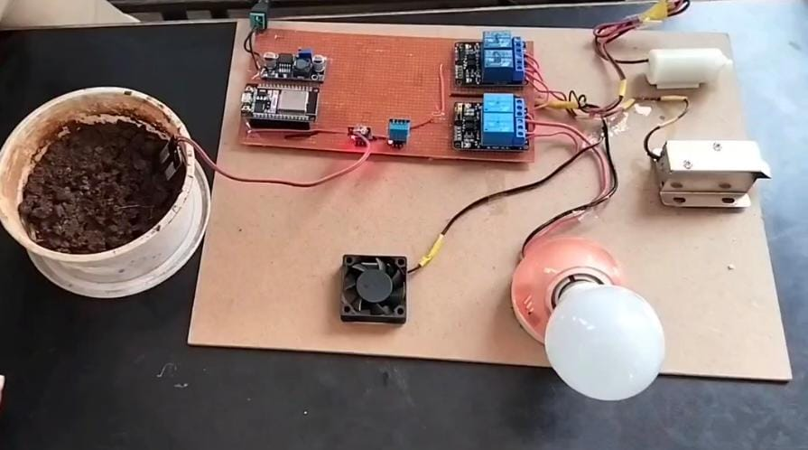
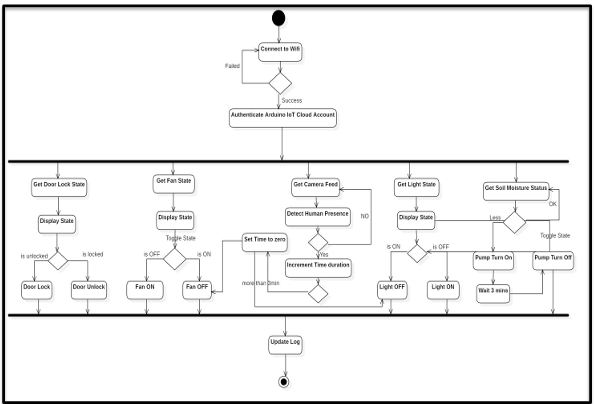
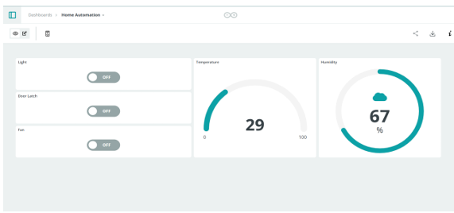
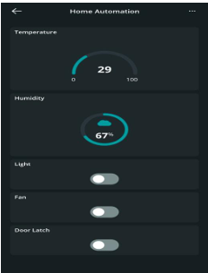

# SmartSpace Automation 🚪💡🌾

A comprehensive IoT-based **SmartSpace Automation System** integrating smart home control, irrigation management, human detection, and voice assistant control.  
Developed using **NodeMCU ESP32**, this project allows control and monitoring of appliances like fans, lights, doors, and irrigation via:

- Arduino IoT Cloud (Web & Mobile App)
- Google Assistant (English, Hindi, Marathi)
- Human Presence Detection

---

## 📷 Project Setup

## 📷 Activity Diagram

## 📷 Website Dashboard

## 📷 Android Dashboard

---

## 🚀 Features

- 🌐 **Arduino IoT Cloud Dashboard & App**
  - Live temperature and humidity monitoring
  - Control buttons for fan, light, and door
  - Accessible via mobile app and web dashboard

- 🗣️ **Google Assistant Voice Control**
  - Operate devices using voice commands in **English**, **Hindi**, and **Marathi**
  - Integrated with **Google Home**

- 🌾 **Smart Irrigation**
  - Automatically waters plants when soil is dry
  - Stops when soil moisture reaches adequate level

- 🚶‍♂️ **Human Presence Detection**
  - Fan and light automatically turn ON upon detecting human presence
  - Turn OFF when no presence detected

- 🏠 **Appliances Controlled:**
  - Fan
  - Light
  - Door (via solenoid)
  - Water Pump (for irrigation)

---

## 📦 Components Used

- NodeMCU ESP32
- PCB
- 4-Channel Relay Switch
- Water Pump
- Soil Moisture Sensor
- DHT11 Sensor (Temperature & Humidity)
- Solenoid Motor
- Buck Converter
- DC Jack
- Wires
- 12V Bulb
- Fan
- Holder
- MDF Board

---

## 📁 Files Included

- `nodemcu_code.ino` — Main code for NodeMCU.
- `/screenshots/` — Photos of actual hardware setup.
- `README.md` — Project overview.

> ⚠️ Circuit diagram is not shared to avoid direct duplication.

---

## 📦 Setup Instructions

1. Upload `nodemcu_code.ino` to NodeMCU using Arduino IDE.
2. Connect all components as per your hardware setup.
3. Set up Arduino IoT Cloud Dashboard and mobile app.
4. Integrate devices with Google Home and IFTTT.
5. Power the system and start controlling via app or voice commands.

---

## 📎 Developed By

**[Aasmi Jugari](https://github.com/AasmiJugari)**
